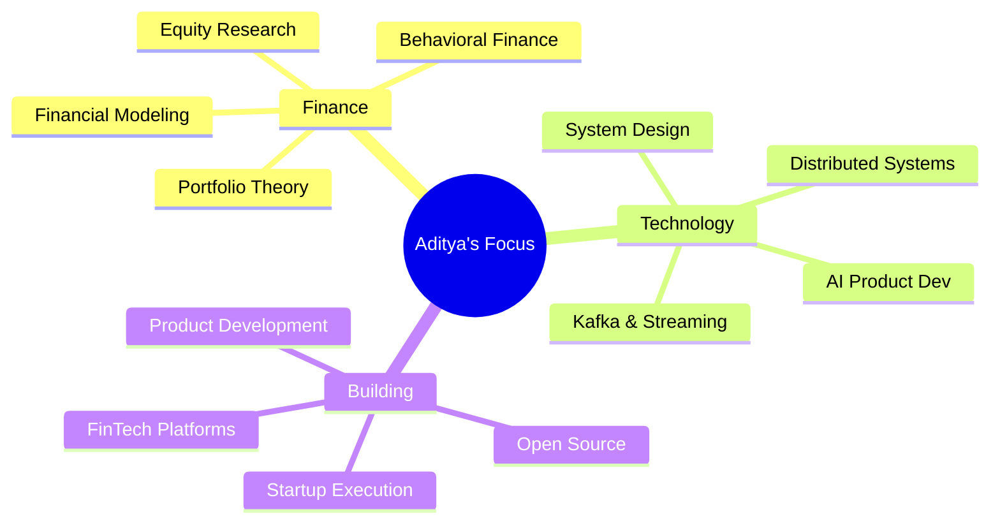

<div align="center">

<!-- Dynamic Typing Header -->


<br/>

<!-- Badges Row -->
<a href="https://linkedin.com/in/aditya-raj-jain">
  
</a>
&nbsp;

&nbsp;

&nbsp;


</div>

---

```
╔══════════════════════════════════════════════════════════════════╗
║                                                                  ║
║    > whoami                                                      ║
║    Aditya Raj Jain — CS student, fintech builder,                ║
║    market analyst, and full-time system thinker.                 ║
║                                                                  ║
║    > ls interests/                                               ║
║    FinTech/  AI/  Blockchain/  Distributed-Systems/              ║
║    Equity-Research/  Startups/  Backend-Engineering/             ║
║                                                                  ║
║    > cat mission.txt                                             ║
║    Democratize financial knowledge.                              ║
║    Build at the intersection of Finance, AI & Code.             ║
║                                                                  ║
╚══════════════════════════════════════════════════════════════════╝
```

---

## 🌌 About Me

> *"I enjoy analyzing markets as much as I enjoy building software."*

- 🎓 **B.Tech Computer Science Engineering** @ Manipal University Jaipur *(Class of 2028)*
- 🏗️ **Building** a Crowdsourced Stock Market Research Platform (AI + Blockchain + Community)
- ⚙️ **Built** a custom Kafka-style message broker from scratch in Java
- 📈 **Obsessed with** financial markets, equity research & behavioral finance
- 🌱 **Currently learning** System Design, DSA, Distributed Systems & Financial Modeling
- 🏆 **Hackathon Winner** | 2x Case Competition Winner | Top 20 @ Ideathon 2025
- 🥇 **Student Excellence Award (SEA 2025)** recipient
- 💬 Ask me about **FinTech, Kafka, Java, Blockchain, Equity Research**

---

## 🚀 Featured Projects

<table>
<tr>
<td width="50%">

### 📊 Crowdsourced Market Research Platform
> *The future of community-driven equity research*

- 🤖 AI-powered sentiment analysis
- ⛓️ Blockchain-based research verification
- 🌐 Decentralized contributor ecosystem
- 📡 Real-time market intelligence
- 🧠 Community-validated insights

`AI` `Blockchain` `FinTech` `Data` `Python` `Java`

</td>
<td width="50%">

### 📨 Custom Kafka Message Broker
> *Built the plumbing. From scratch.*

- ⚡ Kafka-style distributed architecture
- 📬 Event streaming from first principles
- 🏗️ Deep-dive into messaging systems
- 🔧 Pure Java implementation
- 🧵 Concurrent producer-consumer model

`Java` `Distributed Systems` `System Design` `Backend`

</td>
</tr>
</table>

---

## 🛠️ Tech Stack

<div align="center">

### Languages


### Technologies & Tools


### Concepts & Domains


</div>

---

## 🏆 Achievements & Highlights

```
🥇  Hackathon Winner          ................ 1x
🏅  Hackathon Finalist        ................ Multiple
🏆  Case Competition Winner   ................ 2x
💡  Ideathon 2025             ................ Top 20 Finish
⭐  Student Excellence Award  ................ SEA 2025
🔤  State-Level Spell Bee     ................ Achieved
```

---

## 📜 Certifications

| Certificate | Platform | Status |
|-------------|----------|--------|
| 📈 Financial Markets | Coursera | ✅ Completed |
| 🧭 Leadership Skills | Coursera | ✅ Completed |
| 📋 Project Management | Coursera | ✅ Completed |
| 🏦 BlackRock Forage | Forage | 🔄 In Progress |
| 💰 Goldman Sachs Forage | Forage | 🔄 In Progress |
| 🏙️ JPMorgan Forage | Forage | 🔄 In Progress |
| 🏛️ Citi Forage | Forage | 🔄 In Progress |

---

## 📊 GitHub Stats

<div align="center">


&nbsp;


</div>

<div align="center">
  
</div>

<div align="center">
  
</div>

---

## 🎯 Currently Exploring

<div align="center">



</div>

---

## 🌐 Long-Term Vision

> **To build impactful fintech products that democratize access to financial knowledge, investment research, and market intelligence.**

Problems I'm here to solve:

- 🌍 **Financial Inclusion** — Making investing knowledge accessible to everyone
- 🔍 **Research Transparency** — Open, verifiable, community-driven market research
- 📚 **Investor Education** — Bridging the gap between retail and institutional knowledge
- 🤖 **AI-Powered Decisions** — Making data-driven investing the default, not the exception

---

## 🤝 Open To

<div align="center">

| 🧑‍💻 Hackathons | 🌍 Open Source | 🚀 Startup Collabs |
|:-:|:-:|:-:|
| **🧠 Research Projects** | **💼 FinTech Discussions** | **⚙️ SWE Opportunities** |

</div>

---

<div align="center">

### 📡 Let's Connect & Build Together

*If you're working on something at the intersection of **Finance × AI × Blockchain × Code** — I want to hear about it.*

<br/>

[](https://linkedin.com/in/aditya-raj-jain)

<br/>

---


</div>
